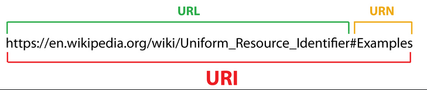
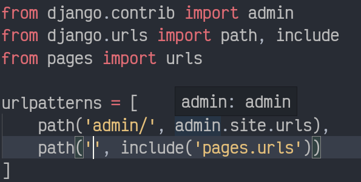

# urls

## documentation

* [django.url](https://docs.djangoproject.com/en/3.1/ref/urls/)
* [URL dispatcher](https://docs.djangoproject.com/en/3.1/topics/http/urls/)

 

 Django has its own url handler which takes a URI ( uniform Resource Identifier) and routes to required views accordingly.

## setting up

* inside settings.py there is variable `ROOT_URLCONF`. The URL patterns described in the said variable is going to be used as a lookup table. 
* Inside the url pattern list there should be definition to create `urls.path` or `urls.re_path` instances.
* If there is a uri and a pattern match, it calls the corresponding view.

## path and re_path

syntax:

            path('pattern',view_related_to_it,name='')
            

## include

Required when one wants to load `urltemplates` from other apps. 

syntax:
    
          include('path')

