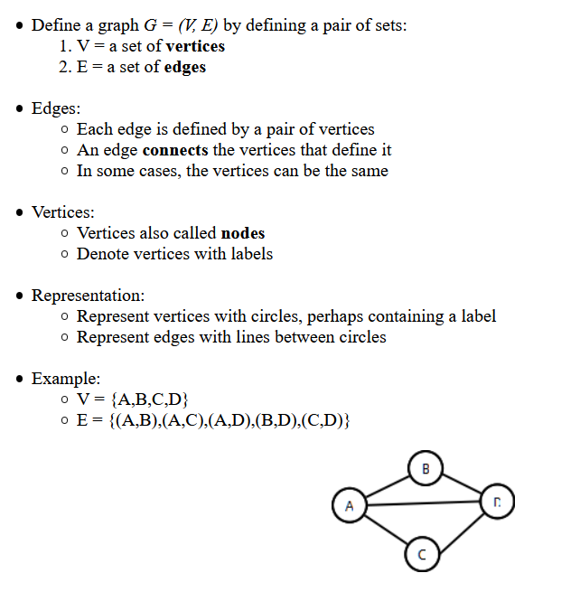
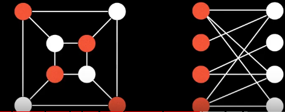

# graphTheory

A graph `G = (V,E)` where V is set of vertices , E is set of edges.

[Radford introduction to graph](https://www.radford.edu/~nokie/classes/360/graphs-terms.html)

## properties of graph

## Weighted and Unweighted
## Directed and Undirected
## tree 
* undirected graph with no cycles

## DAG : directed acyclic graph
* directed graphs but without cycles
* used on git

## bipartite graph

* graph whose vertices can be split into two independent  group U,V such taht every edge connects between U and V.

## How to represent graph with different data structure.

* adjacency matrix

