# Electromagnetic Induction

## motional EMF
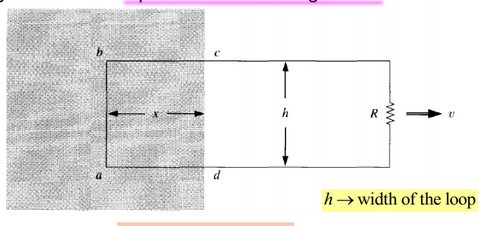      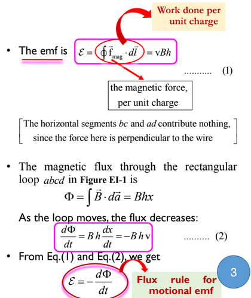

## Faraday law of Induction

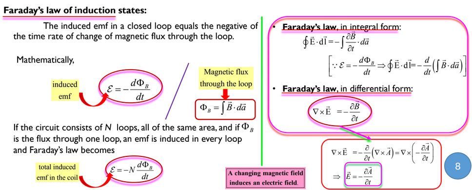

## Lenz law :
oppose the motion
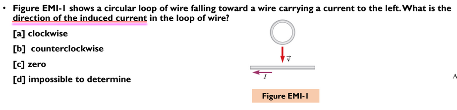

* option B is right ans because: the current is produced to oppose the field. if current flows in same direction(clockwies), then they will attract each other. Which violates the law of physics

## Inductor: 

### inductance of solenoid
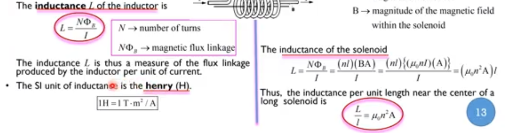

### self inductance

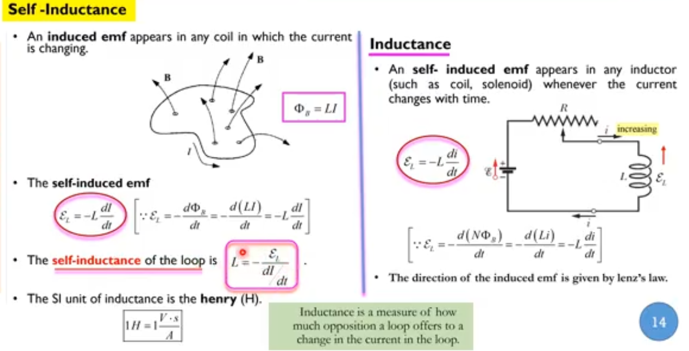

### Mutual Inductance
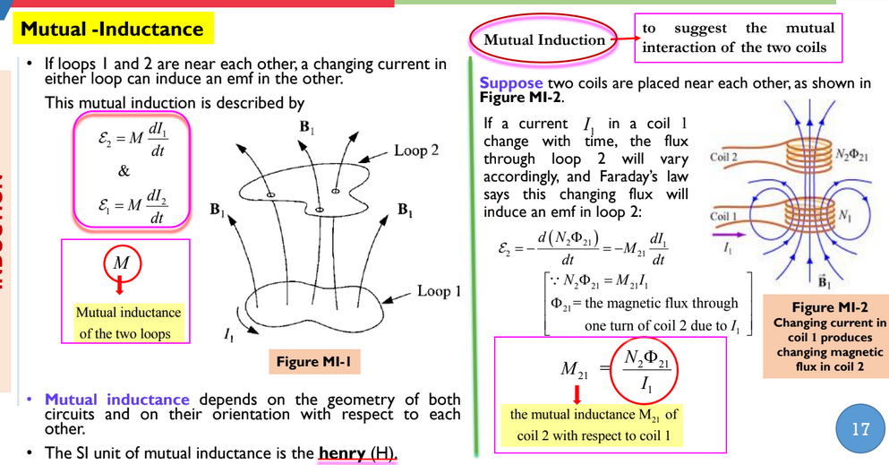

## LR circuit
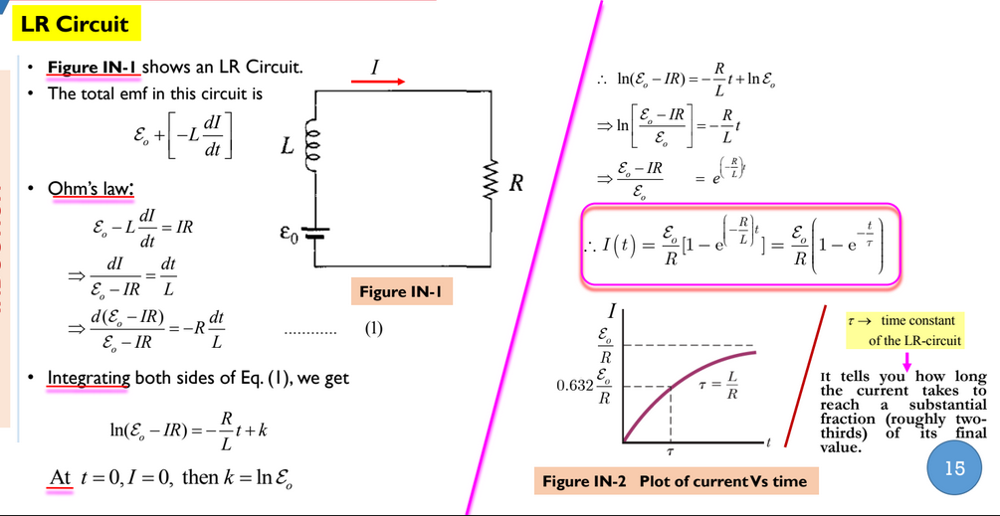

## Neuman formula
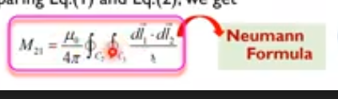

## Reciprocity theorem
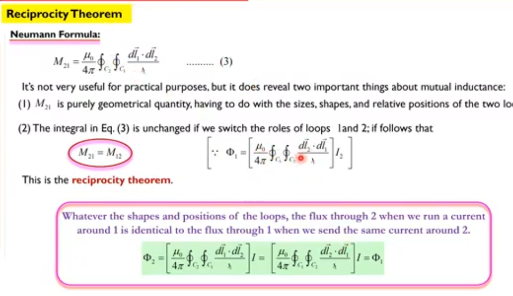

## energy in magnetic field.

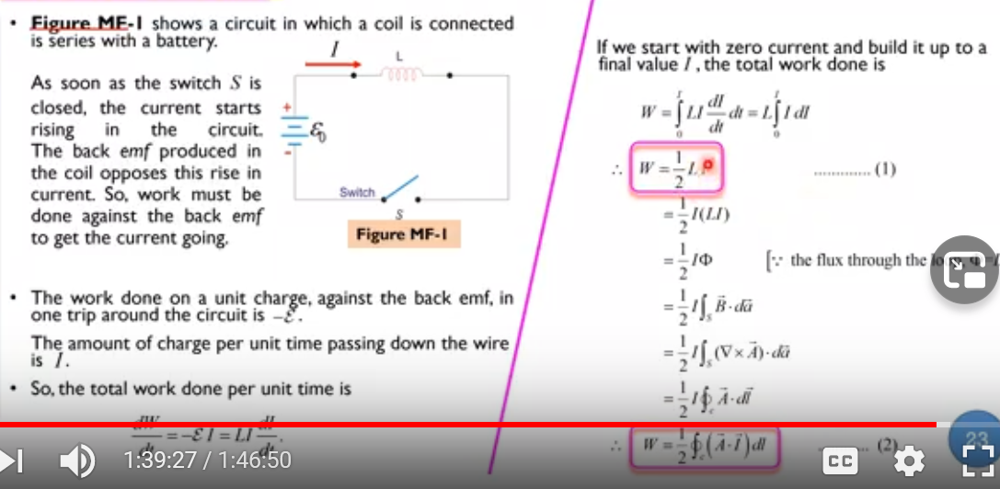

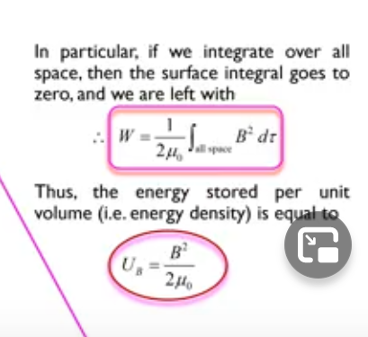
 