# magnetostatics

## magnetic force :

## cyclotron : moves in circle.

* if perpendicular then moves in circle.
* if oblique( some angle in respect to magnetic field). The component which is perpendicular to magnetic field causes the object to move in circular motion . The compoenent parallel to magnetic field causes the charged object to move in straight direction. So helical path.

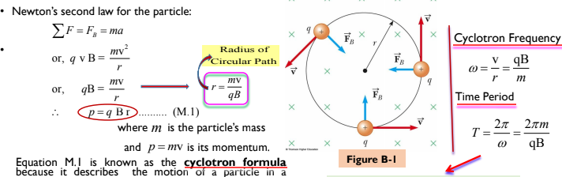

## Line Current 

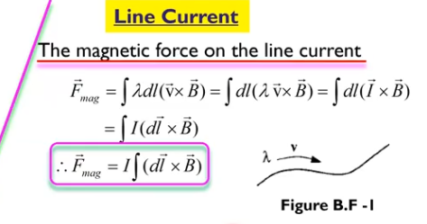

## Biot Savart law

 
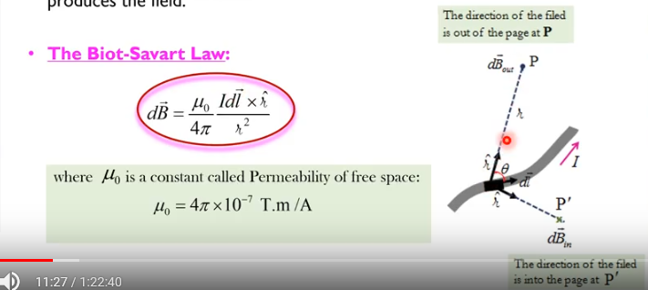

 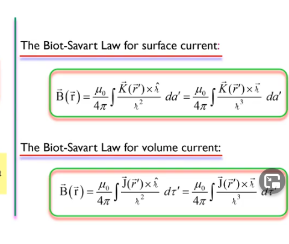

### magnetic field  Biot savart application

#### at point 's' from a long straight wire.
here theta 1  is anti clockwise and theta 2 is clockwise so theta 1 is negative
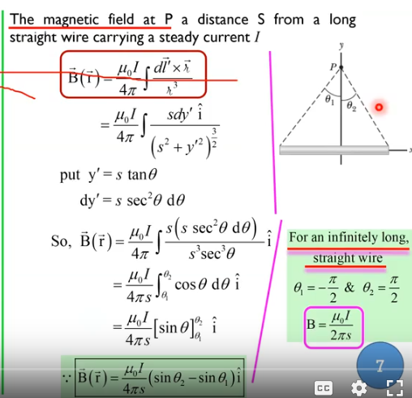

#### due to curved wire segment
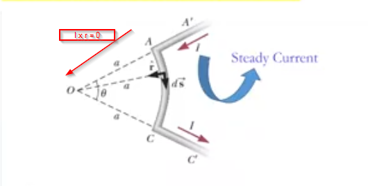
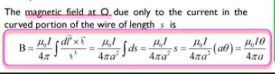

### application of biot savart law

#### magnetic foce between two parallel conductors

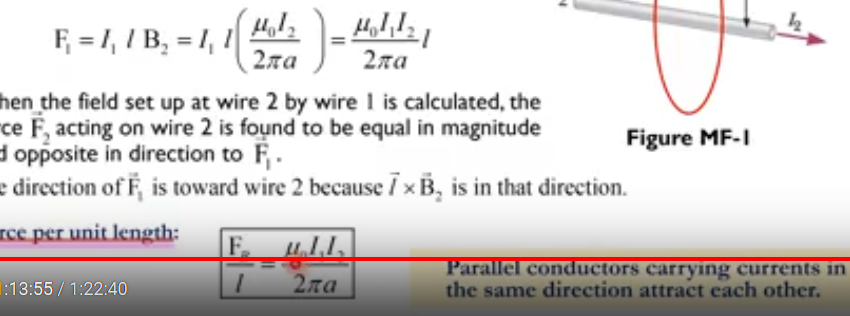

### magnetic field at centre of n sided polygon

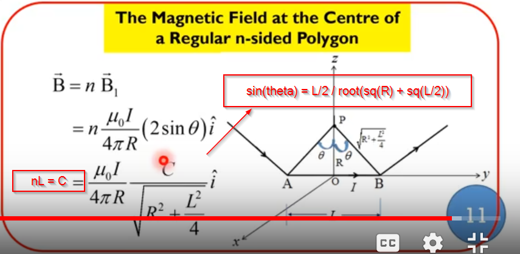

### magnetic field above the center of loop
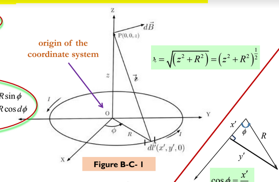

### solenoid
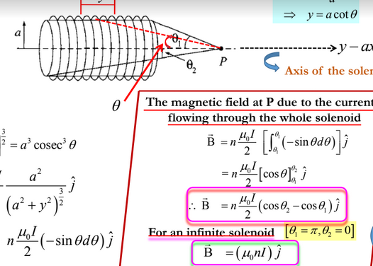

## Ampere's law

### infinite long wire (r < R)
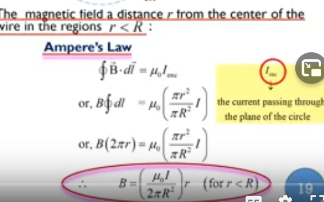

### long wire where current is proportional to area
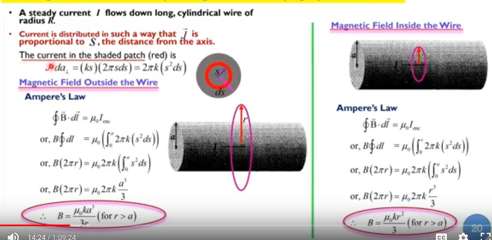

### magnetic vector potential 
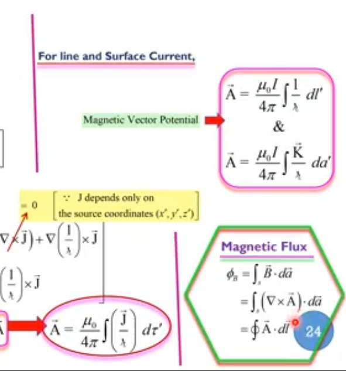

### magnetic vector potential inside and outside of solenoid
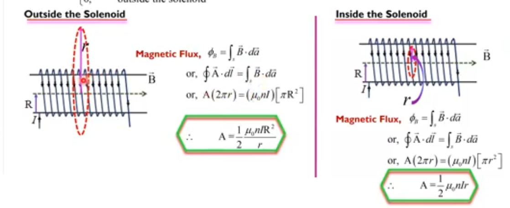