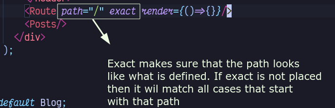
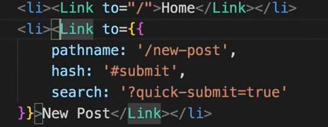
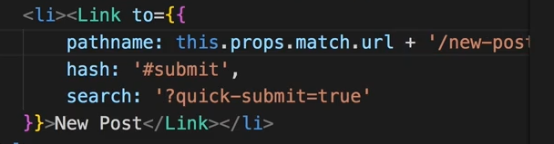
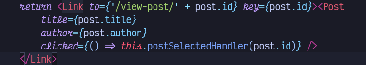
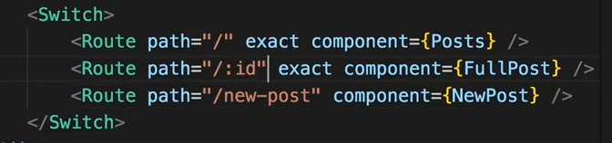
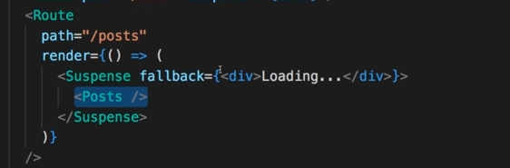
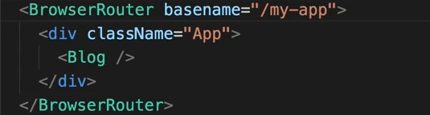

# Routing

## Setting Up

## Multiple pages 

* Main component that requires routing should be enclosed in Browser Router

* instead of  render use component to route to component
* Multiple Components can have same route and they all will render

* instead of anchor tags, React router provides with a link component that makes sure that we prevent the default behaviour. `e.preventDefault()` but on steroids.

* When ever route is successful. The component that is loaded for that route receives a props, that is injected by react router itself. 

* The router targets a component and receives a prop but its child components don't receive those props. To be able to access those props.
    * Either `{...this.props}` as a attribute to the Child Container.

            <ChildContainer {...this.props} />
    * Or use `withRouter` Higher Order Component.

* convert absolute path to relative path
* 

* For a navBar link use `navLink` instead of `link`. for Styling purpose.

* Passing in Route Parameters : 
    * Add `:ParamName`. Object will be added later as `this.props.match.params.ParamName`.
        

		
* Want to load only one route. use . makes sure one router is loaded and another one is no longer loaded.~~~~
    
    

* the `:id` part moves in as `this.props.match.params.id`

## Nested Route

* If a main component is inside a `<BrowserRouter/>` then it is eligible to be placed anywhere.
* Where ever router stays. or which ever component Router resides . The section Router doesn't touch will keep on rendering. Router doesn't update everything.
* Nested Routes are required if a routed component requires a route. Routed components section will remain untouched and will render. 
* Exact can also be handy here.

## Redirect

### Conditional Re-routing

* For a conditional redirect, normal state based contionals will work.

## Guards

* Authenticated or Not?
* Generic state based conditional approach

## 404 case

* Don't add path to `Route` . it will load if 404 case is met
* 

## React suspence

* won't work for server side rendered page
 * Works for 16.6+

* add `Suspence` to import from react

* want to setup where url is `exampl.com/my-app` instead of  `exampl.com/`

