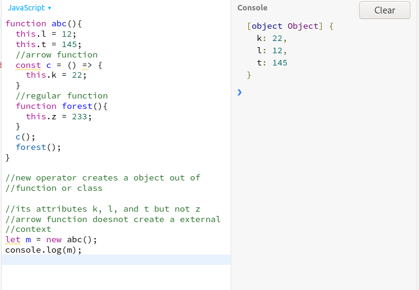

# javascriptRefresher

## Strict mode 
 * Strict Mode introduced in ES5 allows to write more secure javascript.
 * Solves problem that arises due to hoisting. Can't define before you declare.
 * can be invoked by `use strict` on top of file.
 * classes are alwys run in strict mode.

## classes 

    
 *  Classes defined with 
                
                class Identifier extends ParentIdentifier {
                                constructor(){
                                }
                                methods(){
                                }
* Public and private member variables
    * public field declaration with `abc=12`
    * private field declaration with `#abc=12`
        * when accessing private declaration with this. the syntax is `this.#abc`
* There are getters and setters
    *  `get identifier(){ return 12 }`
* Classes are run strict mode.  
   
 
## Spread and Rest Operator and Destructuring
     
 

## Reference and Primitive types

### shallow and Deep copies
#### Shallow copy 
 
* use spread operator
* `const person = {'a':12','ref':{'c':123}}`
* `const copyPerson {...person}`
* However if you change the value of  c inside ref. in copyPerson. The change will be reflected on person too.

#### Deep copy
*` JSON.parse(JSON.stringify(data))`
