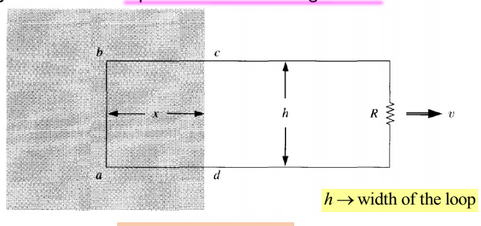
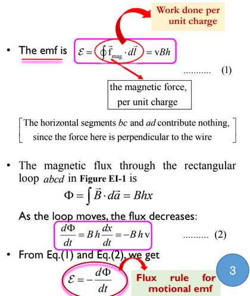
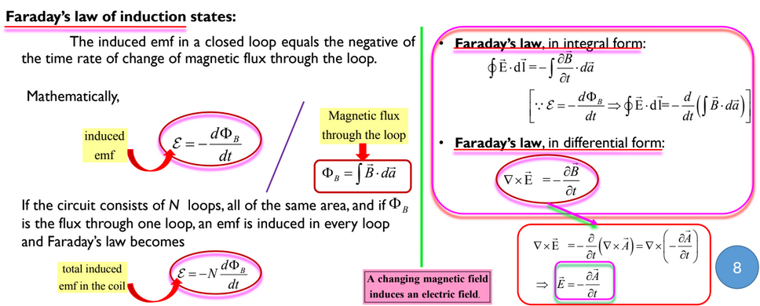
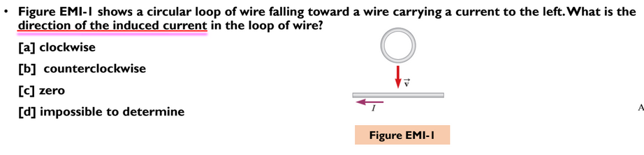
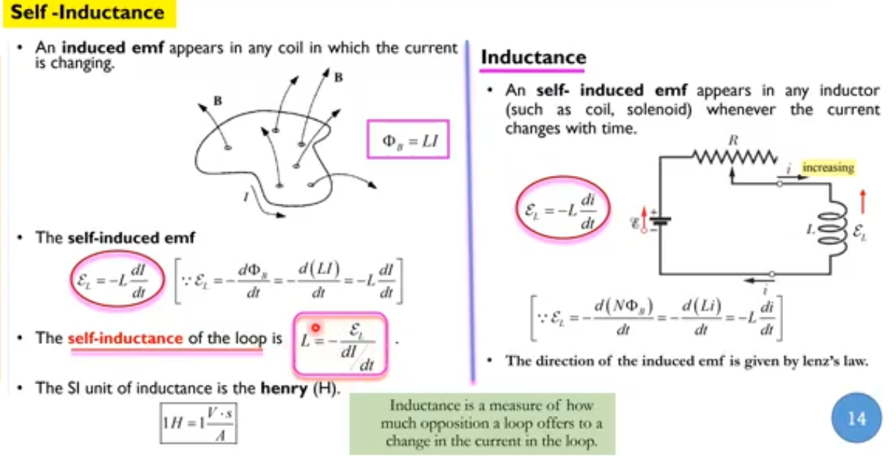
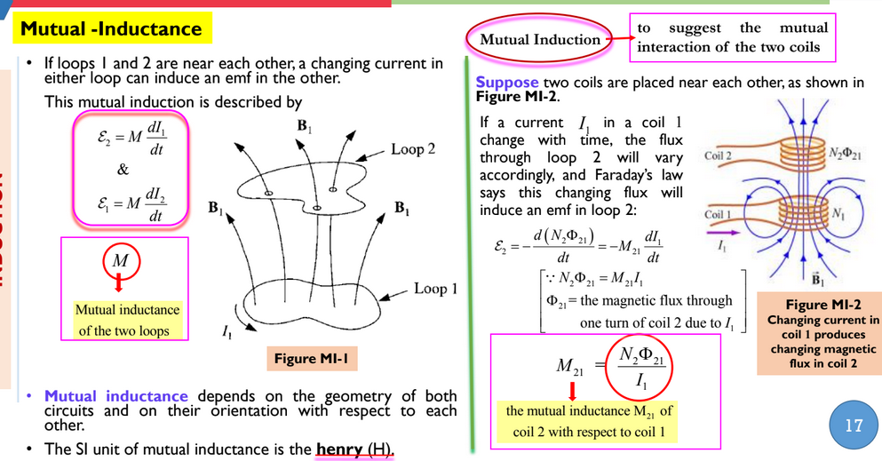
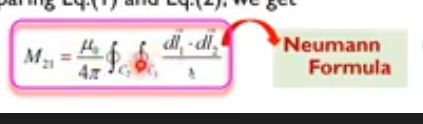
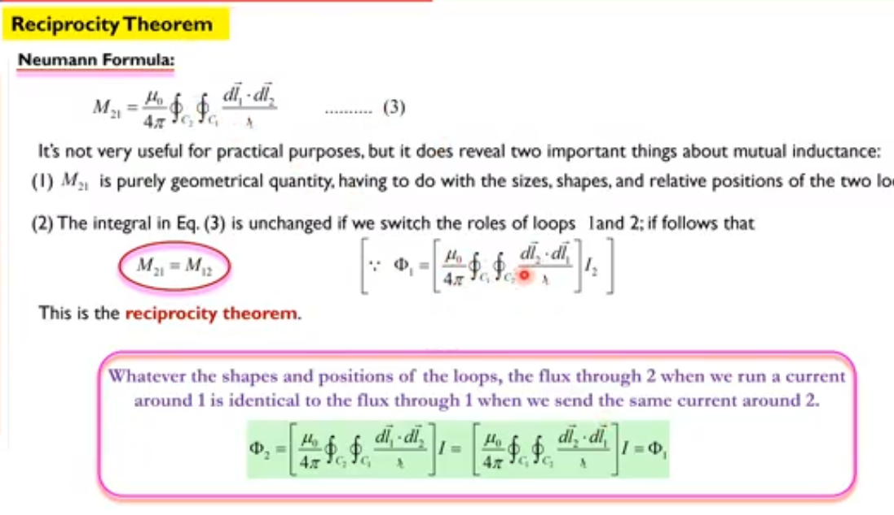
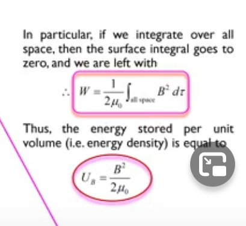

# Electromagnetic Induction

## motional EMF
      

## Faraday law of Induction

## Lenz law :
oppose the motion

* option B is right ans because: the current is produced to oppose the field. if current flows in same direction(clockwies), then they will attract each other. Which violates the law of physics

## Inductor: 

### inductance of solenoid

### self inductance

### Mutual Inductance

## LR circuit

## Neuman formula

## Reciprocity theorem

## energy in magnetic field.

 