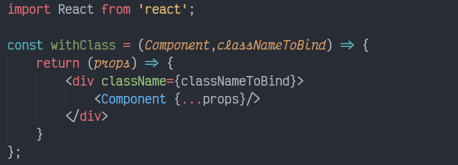

# React

## Setting up

            npm install create-react-app  -g
            create-react-app {appname}

## Inside React app

1. Uses Linter and code formatter such as eslint and prettier.
2. To bundle up the application it uses webpack
3. For ES6 conventions and JSX support uses webpack 

## Getting started

* `node_modules` folder is generated automatically. And generally we are not concerned with it. It contains the executable of general applications we are going to use such as `prettier` and `eslint`. 
* `public` has something to do with building : todo update 
* `src` is the folder we are concerned with. It contains all the app components, tests, css files etc

## App component

* Example

        import React from 'react';
        import ReactDOM from 'react-dom';
        class App extends React.component{
            render(){
                return (
                    React.createElement("div",{className:"primary"},
                        React.createElement("h1",null,"As a man thinketh")
                        );
                )
            }

        ReactDOM.render(<App/>,document.querySelector("#root"));

* A Prop in react component can't be changed. It's read only. 
* Two types of components
    * Functional component : dumb components that doesn't require any knid of updates and those which can remain static.
    * Class based component: These are stateful compnonents whose states can be changed according to the requirement.

## States

* states can't be changed directly. Have to change it through `this.setState()`

* when handling events like onClick , only pass in the reference `onClick = {this.myFunc}` instead of `this.myFunc()`. 
    * Inside myFunc
            
               const myFunc = () => {
                   this.x =12; //this is invalid because of the way js works
               }

## Hooks

* Hooks are new way of writing react based components.
* The difference between class based state changing and hook based state changing is that any change in state causes the update for  state attributes  defined in function only. other remain unchanged. Here The attribute or property that got changed is replaced and other unchanged property remains same.
* Where as in hook based state change, The state change causes the whole object to be removed and replaced as defined. 
* To use it elegantly, one will have to use `useState` multiple times.

## To dynamically set css 

* use radium to add psudo selectors to js object classes.
* media queries supported by radium Styleroot is needed
* another method is to use App.module.css look up in chapter 5. TODO

## Component lifecycle

* For a class based component there are various functions that javascript will load and unload 

* If the child component requires all the props passed to it to be updated, for it to render then you can use `pureComponent`

## Function based component

Function based component has `useEffect()` which has to be imported from `react`, that runs everytime a component is mounted or updated(lets say re rendered on virtual DOM)

How to use componentDidMount 
`useEffect(YourFunction, [])`

componentDidUpdate
`useEffect(YourFunction, [props.dataWhichIWantToChangeIsChanged])`

Anything `useEffect(YourFunction, [])` returns, it is run once the component is unmounted . you can return a function.

Similarly The return function will run once it is updated succesfully if `useEffect(YouFunction,[asdfasd])` is used.

`ShouldComponentUpdate()` -> i dunno you say, with `React.memo()` run as `export default React.Memo(ComponentName)`

*  Runs if any props passsed to the component is changed else doesn't.

## HOC( Higher Order Component)

* The convention is to start HOC with `with` in front of their name.
* Purpose of higher level component is to add in extra layers of either `jsx` or any other wrapping layers that does specific tasks to increase the usability and the purpose of component. 
* If the HOC is not a component itself but a function that returns a component then for passing proper props to the component it is layering on top of use `{...spread}` operator.

  
  

### React.fragment 
* React requires jsx we return to be wrapped in parent element . 
* To tackle that problem either use a list with keys defined 
* use `React.fragment`
* `React.fragment` is a function based component that just returns a `props.children`

## React States

    this.setState((prevState,props) => {
        return { myObj : prevState.myObj + 1 }
    });

## PropTypes

* Javascript, a dynamically typed programming language: requires a proptype definition for its React library, if one wants a proper documentation. 
* `npm install --save prop-types`
* Wherever you want to add a proptype. 
        * `import PropTypes from 'prop-types`
        * `Component.propTypes = { 
         click: PropTypes.func,name: PropTypes.string}`
* Get a warning if different proptype is used.

## Ref

* References ? Why need them. First off the query selectors and all those browser magic methods we use have a pretty serious flaw when used with react. The way they select and process things are based upon the browser DOM tree. React however keeps its own version of its virtual DOM. 
* To get the references to elements in virtual DOM, we can use references. 
* inside the component  `ref = {(inputElement) => {this.inputElement = inputEl)}`
*  then in componentDidMount you can use this.inputElement.focus or anything query related 

* Modern way :
        
        inside a constructor :
                 construcotr(props){
                     super(props);
                     this.inputElementRef = React.createRef();
                 }

        where the components are placed
                <Component ref = {this.inputElementRef}/>

### Ref for functional component

####  `useRef()`

        const toggleRef = useRef(null);
        useEffect(() = > {
                        toggleRef.current.click();
                        },[]);
        return (
        <Component ref={toggleRef}/>)

## Context

* Lets say we have a chain of components, where parent component has to pass props to child on 3rd child component or 4th for that matter but , the components in between doesn't use some props. that we are passing specifically for our 4th component. 
* There will be chain of props, which increases redundancy in the code.
* To avoid redundancy, one can use Context API

### For a class based component.

* `auth-context.js`

        const authContext = React.createContext({first:'handle', second: 'handle'})
        export default authContext;

* `provider`

        import that authContext;
        <AuthContext.Provider value={props that you want context to handle}>
        </AuthContenxt.Provider>

* `consumer`

        import that authContext;
        <AuthContext.Consumer>
                {(context) => context.handleDataFromContext ... 
                }
        </AuthContext.Consumer>

### another elegant way 

* For a consumer

* now AuthContext can be accessed by`this.context.authenticated`

### for a functional based container

* `import {useContext} from 'react';`
 

* can use the constant authContext to access the context
